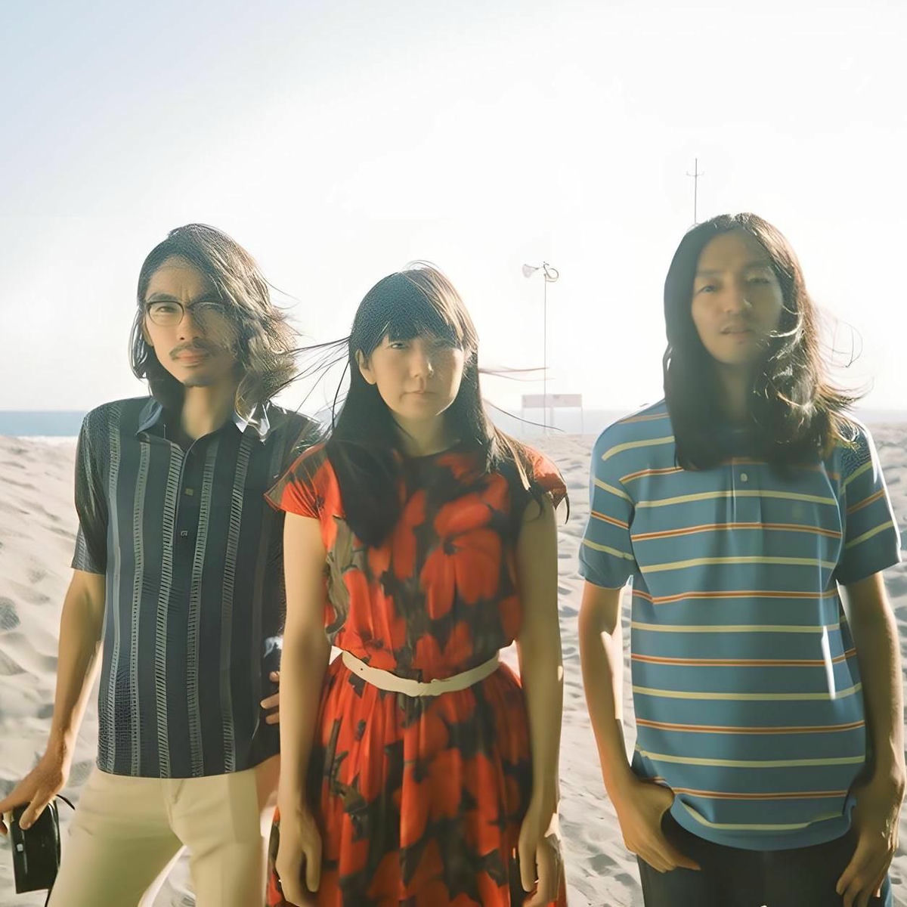

<video controls>
  <source src="yokaze.mp4" type="video/mp4">
  Your browser doesn't support the video tag.
</video>

## Synopsis

_Yokaze_ (夜風, yokaze — "night wind") follows a solitary figure wandering through Tokyo's quiet backstreets as dusk settles. The film uses minimal dialogue, relying instead on ambient sound and long takes to capture the transient beauty of fading light.

## Technical Notes

- Runtime: 12 minutes
- Format: 16mm film transferred to digital
- Sound: Diegetic only, no score
- Shot on location in Shimokitazawa, Tokyo

## Themes

The work examines impermanence through seasonal imagery—cherry blossoms in gutters, wet pavement reflecting neon, the last warmth of day dissipating. The lamp in the poster serves as a recurring motif, representing both guidance and isolation.

## Credits

- Director: Unknown
- Cinematography: K. Tanaka
- Sound Design: M. Sato
- Color Grading: Studio Palette

---

_Published March 2024_
